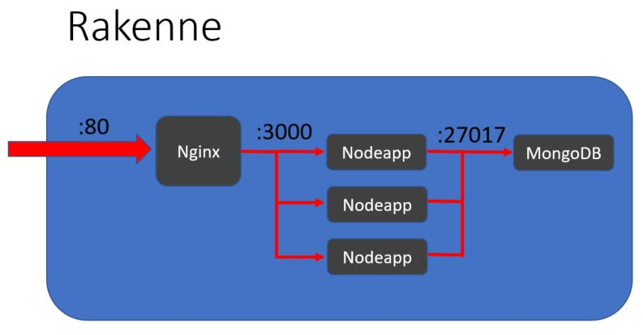

# Projekti - Ryhmä G

### Rakenteen käynnistys

Tuo projekti Github:sta. Tämän jälkeen suorita projektin juuressa: 

Yksinkertainen käynnistys
```
docker-compose up -d
```
Usean Nodeapp:n käynnistys kuormituksen tasauksella
```
docker-compose up -d --scale nodeapp=[haluttu määrä instansseja]
```
---
## Projektin rakenne

Projektin pohjana toimii Node-ympäristön Express-websovellus (Nodeapp), johon on rakennettu yksinkertainen verkkosivusto. Verkkosivustolla käyttäjä voi luoda eri sivuille muistiinpanoja, jotka tallentuvat MongoDB-tietokantaan.  
Sivustolle tulevaa liikennettä ohjataan Nginx:n avulla. Mikäli projekti on käynnistetty usean Node-applikaation kanssa, Nginx tasaa kuormaa luotujen instanssien välillä. 

Nginx, Nodeapp ja MongoDB suoritetaan erillisinä Docker-kontteina, jotka pystyteään samanaikaisesti
Docker Compose:n avulla. 

Yksittäiset kontit kommunikoivat keskenään Composen:n automaattisesti luoman verkon avulla.  



---

## Docker

### Dockerfile : Nodeapp-imagen luonti

Projektia varten luodun Nodeapp:n image täytyy rakentaa Dockerfile:n avulla. Dockerfilessä projektin pohjaksi haetaan Node.js -kuva. Tämän jälkeen projektin riippuvuudet sisältävä package.json siirretään osaksi imagea. Tiedoston avulla suoritetaan npm install -komento, joka asentaa kaikki tarvittavat riippuvuudet. Tämän jälkeen loput projektin tiedostot (poislukien .dockerignore -tiedostossa määritetyt) siirretään osaksi imagea. 

Muiden projektin konttien image:t saadaan valmiina Docker Hub:sta.

<br>


## Docker Compose ja konttien määrittelyt

Suuri osa projektin tarvitsemista määrityksistä tehdään docker-compose.yml -tiedostossa.  
Tässä osassa käydään läpi eri konttien määritelmät. 

### Nginx

```dockerfile
  nginx:
    image: nginx:stable-alpine
    ports:
      - "80:80"
    volumes:
      - ./nginx/default.conf:/etc/nginx/conf.d/default.conf:ro
    depends_on:
      - nodeapp
```
Compose luo uuden kontin Alpine-jakelun Nginx kuvan pohjalta ja avaa sille 80-portin web-liikennettä varten.  
Projektiin on luotu konfiguraatiotiedosto Nginx:ää varten (/nginx/default.conf), joten volumes-kohdassa luodaan bind mount, joka yhdistää luodun tiedoston Nginx:n tiedostopolkuun, josta se olettaa löytävänsä määrittelyt. 

```conf
server {
    listen 80;

    location / {
        proxy_set_header X-Real-IP $remote_addr;
        proxy_set_header X-Forwarded-For $proxy_add_x_forwarded_for;

        proxy_set_header Host $http_host;
        proxy_set_header X-NginX-Proxy true;
        proxy_pass http://nodeapp:3000;
        proxy_redirect off;
    }
} 
```
Nginx määritellään reverse-proxy -palvelimeksi, joka ohjaa liikennettä. Tässä tapauksessa se ohjaa 80-porttiin saapuvaa verkkoliikennettä nodeapp:lle porttiin 3000.  
Se on myös asetettu jakamaan liikennettä eri nodeapp-instansseille jos niitä on luotu useita Compose:n avulla. 

<br>

### MongoDB

```dockerfile
  mongo:
    image: mongo
    environment:
      MONGO_INITDB_ROOT_USERNAME: user1
      MONGO_INITDB_ROOT_PASSWORD: user1
    volumes:
      - mongo-db:/data/db

volumes:
  mongo-db:
```
Projektin tietokantana toimii MongoDB, jota on helppo käyttää Express.js-tyylisen webapplikaation kanssa.  
Mongo:n määritykset on jaettu kahteen osaan: Compose:n kautta tuleviin, sekä Nodeapp:n sisällä tapahtuviin.  
Compose:ssa tapahtuvat määritelmät ovat yksinkertaiset, Mongo saa root-käyttäjän tiedot ja sille annetaan käyttöön nimetty volume. Volumen avulla tietokantaan tehtävät muutokset saadaan pysyviksi, eikä tietokanta nollaannu käynnistysten välillä.  

Nodeapp:n käyttöön tulevat MongoDB-määritelmät tapahtuvat osana nodeapp:n käynnistystä Compose:ssa:
```
    environment:
      - MONGO_USER=user1
      - MONGO_PASSWORD=user1
```
Näin saatava ympäristömuuttujat viedään erilliseen Mongo:lle luotuun määrittelytiedostoon (/config/config.js), jossa Nodeapp:iin vietäviä muuttujia voidaan muokata. 

```js
module.exports={
    MONGO_IP: process.env.MONGO_IP || "mongo",
    MONGO_PORT: process.env.MONGO_PORT || 27017,
    MONGO_USER: process.env.MONGO_USER,
    MONGO_PASSWORD: process.env.MONGO_PASSWORD,
}
```
Näihin määrityksiin viittaamalla Nodeapp saa yhteyden Mongo:n tietokantaan ja pystyy tekemään siihen muutoksia. 

<br>

### Nodeapp

```
  nodeapp:
    build: 
      context: .
    depends_on:
      - mongo
    volumes:
      - ./:/app
      - /app/node_modules
    ports:
      - "3000"
    environment:
      - PORT=3000
      - MONGO_USER=user1
      - MONGO_PASSWORD=user1
    command: npm run dev 
```
Ensimmäisenä Compose rakentaa Nodeapp:n aiemmin tehdyn Dockerfile:n pohjalta. Kontti asetetaan odottamaan mongo-kontin valmistumista, jotta niiden välinen toiminnallisuus ei rikkoonnu.  
Projektin sijainti mountataan, jotta kontti saa käyttöön kaikki tarvittavat tiedostot, mutta sen lisäksi node_modules -sijainnille luodaan oma volume, jotta kontin ja host:n module-tiedot saadaan pidettyä erillään toisistaan. Tällä pyritään estämään kehitystyöstä johtuvien riippuvuusongelmien muodostumista. 
Nodeapp:lle avataan portti 3000, johon Nginx ohjaa tulevaa liikennettä. 

Kontti luo jo aiemmin mainitut ympäristömuuttujat Mongo:a varten ja ajaa lopuksi applikaation käyntiin Node-komennon avulla. 

## Nodeapp

Nodeapp itsessään on yksinkertainen Express-applikaatio, joka esittää käyttäjälle muutaman sivun kokoisen websivuston ja antaa mahdollisuuden lisätä omia muistiinpanoja eri sivuille.

Nodeapp käyttää HTML-sivujen esittämisessä EJS-kieltä, minkä avulla tietokantaan luodut muistiinpanot on helppo esittää käymällä ne läpi silmukan avulla ja lisäämällä niiden tiedot valmiisiin EJS-rakenteisiin. Sivuston tyylien muokkaus tapahtuu pääsääntöisesti Bootstrap:n avulla.  
Esimerkki EJS-silmukan käytöstä:  

``` js
<% blogs.forEach(blog => { %>
    <h4 class="card-title"><%= blog.title %></h4>
    <div class="card-subtitle text-muted mb-2">
        Author: <%= blog.author %>
    </div>
        <pre><div class="card-text mb-2"><%= blog.blogtext %></div></pre>
    <div class="card-subtitle text-muted mt-4">
        Created: <%= blog.createdAt.toLocaleDateString() %>
    </div>
    <%
})%>
```

Applikaation suoritus tapahtuu server.js -tiedoston kautta.  
Sever.js tiedostossa määritellään applikaation käyttämät moduulit sekä Mongo-tietokanta. Tietokannan määritykset saadaan aiemmin mainitusta config-tiedostosta.  
```js
const mongoURL= `mongodb://${MONGO_USER}:${MONGO_PASSWORD}@${MONGO_IP}:${MONGO_PORT}/?authSource=admin`
```
Tietojen avulla Nodeapp yhdistää tietokantaan, mikä mahdollistaa tietokantaobjektien käsittelyn. Tietokantaa varten models-kansiossa olevassa blogModel.js -tiedostossa määritellään tietokantaan lisättävän "muistiinpano" -objektin sisältö. Tässä applikaatiossa tämä on ainoa käytössä oleva tietokantaobjekti. 

Sivuston sisäistä logiikkaa ohjataan Routes-kansiossa olevilla router-objekteilla. Routerit ohjaavat niille määrättyyn webosoitteeseen suuntautuvaa toimintaa. Routerien käyttöönotto ja niiden vastaavan osoitepäätteen määrittely tapahtuu server.js tiedostossa: 

```js
const dockerRouter = require("./routes/dockerRoutes")
const composeRouter = require("./routes/composeRoutes")

app.use("/docker", dockerRouter)
app.use("/compose", composeRouter)
```
Routerien määrittelyissä ohjataan tyypillisten REST-metodien toimintaa. Pääasiallisesti ne ohjaavat liikenteen oikeille sivuille ja hoitavat Mongo-objektien tallenus- muokkaus ja poisto-operaatiot. 
